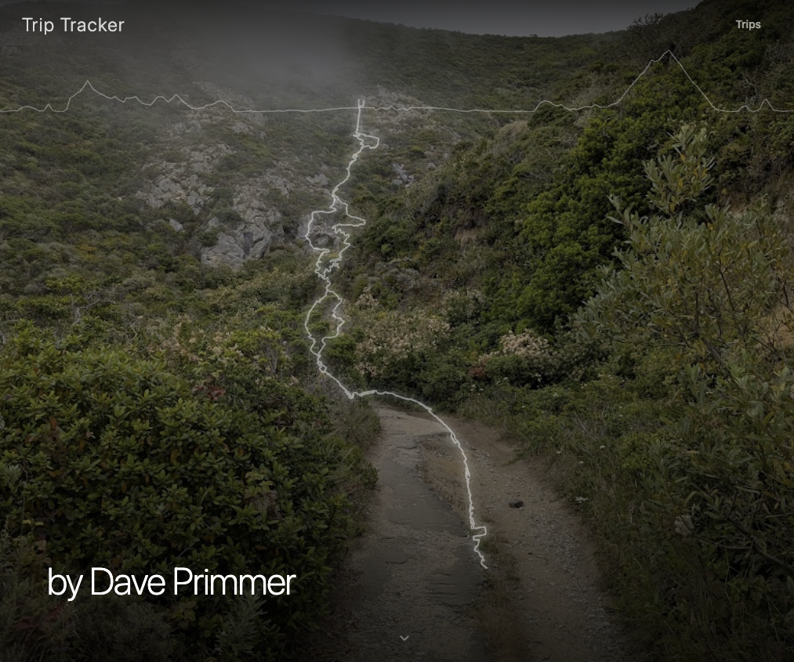
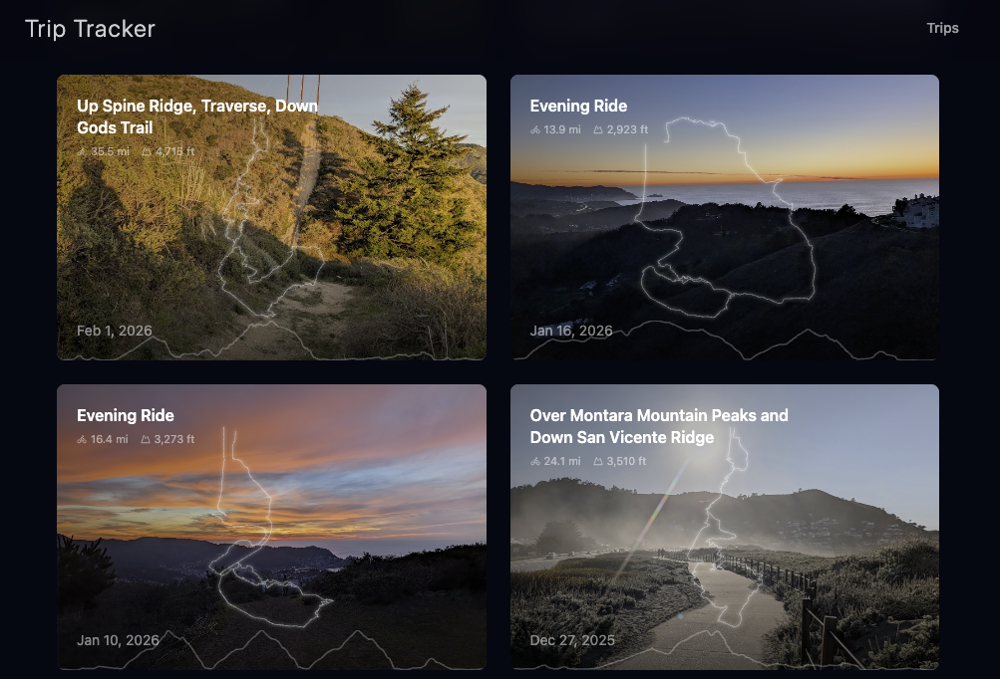
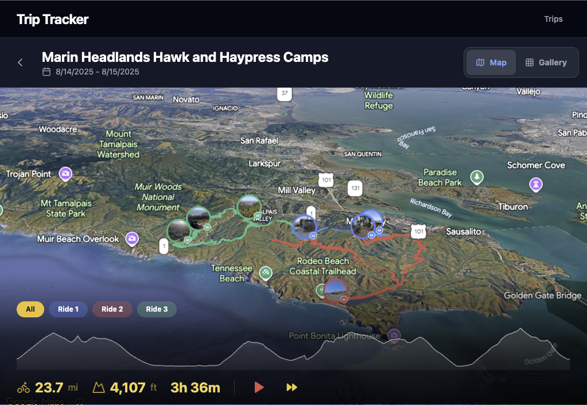
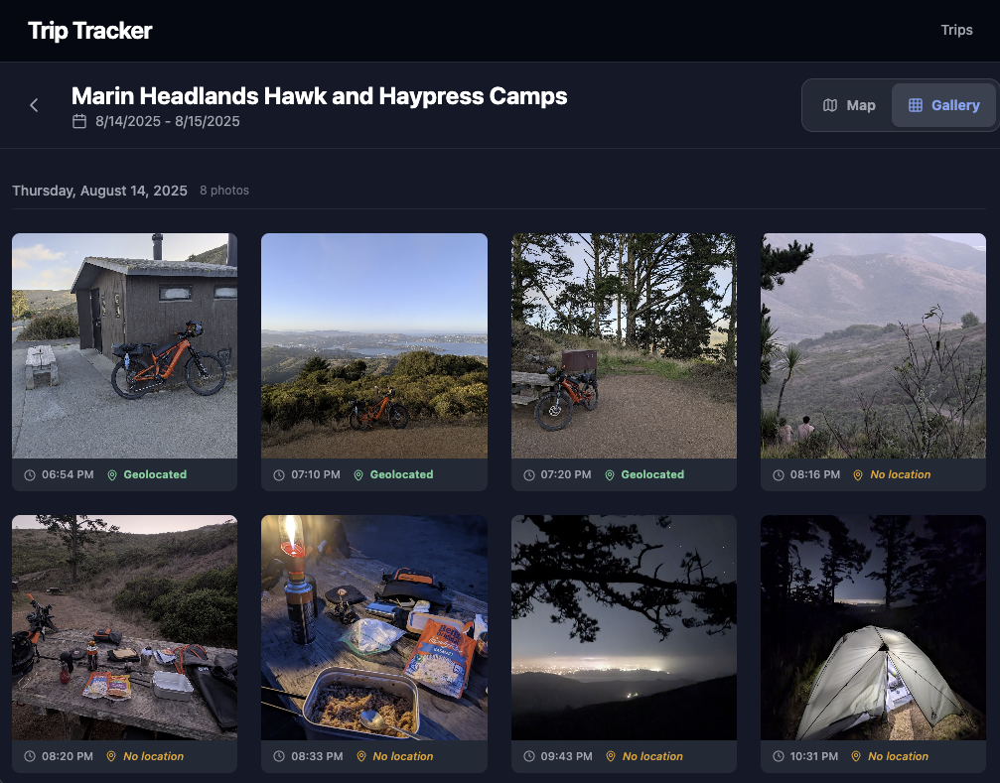

# Bike Trip Tracker

A web app for tracking bike trips and bikepacking adventures that focuses on photography. Integrates Strava for routes and activities, Google Photos for geotagged imagery, and Google Maps for interactive satellite and 3D map display. The emphasis is on visual storytelling and photo presentation, not data logging.

|  |
|:--:|
| Full-bleed hero with route overlay |

## Features

- **Trip grouping** — Strava activities can be grouped into multi-day trips via hashtags in the private activity description (e.g. `#three_day_headlands_trip`). Within these grouped trips, individual rides are color-coded and can be explored.
- **Activity exclusion** — Add `#no_triptracker_sync` to any Strava activity private description to keep it out of the app. Useful for commutes, trainer rides, or trivial stuff. If no photos were taken during that trip, it might be useful to exclude it.

|  |
|:--:|
| Trips grid with route overlays and photo backgrounds |

- **Photo mapping** — Photos added per-trip via Google Photos picker. Google photos strips GPS info so geolocation is derived by matching photo timestamps against GPS streams. Photos taken during a ride appear as markers on the map.
- **Interactive maps** — Full-bleed satellite/hybrid map with 3D tilt and rotation. Scrubbable elevation chart with live map marker. Route animation with play/pause and speed controls.

|  |
|:--:|
| Interactive 3D map with photo markers, route polylines, and elevation chart |

- **Photo/video gallery** — Grid of thumbnails grouped by date with a lightbox supporting keyboard nav and swipe gestures.

|  |
|:--:|
| Per-trip photo gallery with geolocation status |

- **Admin Mode** - Manage the data in the app -- sync strava and photos via the admin UI which is hidden to normal users.
- **POI highlighting** *(planned)* — Identify significant geographic points of interest (mountains, ridges, parks) along each route and surface them in the trip narrative. The app assumes you curate your own Strava activity titles; the goal is enrichment, not replacement.

## Tech Stack

- **Frontend**: React, TypeScript, Tailwind CSS, Vite
- **Backend**: Firebase Cloud Functions (Express), Firestore, Firebase Storage
- **APIs**: Strava, Google Photos Picker, Google Maps JavaScript API

## Code Quality

- **Linting**: ESLint with TypeScript strict mode, naming conventions, and import rules
- **Formatting**: Prettier, enforced via pre-commit hook (Husky + lint-staged)
- **Testing**: Vitest with coverage thresholds (30% minimum), React Testing Library
- **Dependency hygiene**: knip for unused dependency detection (`npm run knip`)
- **Error tracking**: Sentry on both frontend and backend (production only)

## Design Decisions

### Homepage

- Full-bleed hero photo that randomly rotates among trips with photos. Route polyline and elevation profile line overlay the hero, with a dark top gradient for nav/elevation contrast.
- Trip grid shows only trips with photos. Each tile has a photo background, route polyline, and elevation line at the bottom.
- Nav shows only "Trips" (plus "Admin" when in admin mode).

### Trips Page

- All trips listed grouped by month, regardless of photos. Same tile design as homepage.

### Trip Detail Map

- Full-bleed satellite/hybrid map using Google Maps vector rendering with 3D tilt and heading controls enabled. Users can tilt into 3D and rotate the map freely.
- Bottom overlay contains a scrubbable elevation chart, ride stats (distance, elevation, duration), and route animation controls. The overlay uses a gradient background and is positioned to avoid conflicting with Google Maps' own zoom/tilt controls on the right side.
- For multi-day trips, pill-style ride selector buttons ("All", "Ride 1", "Ride 2", etc.) filter which activity is shown. Selecting a ride re-fits the map bounds to that activity.
- Scrubbing the elevation chart places a marker dot on the map at the corresponding GPS position, with a tooltip showing distance, elevation, and grade.
- Route animation plays a dot along the route path with play/pause and 1x/2x speed controls.

### Trip Detail Photos

- Map photo markers are circular thumbnails. Clicking one opens a dimmed full-viewport preview that covers all UI (rendered outside the Maps component). Clicking the preview photo goes to the gallery lightbox; clicking off dismisses.
- Gallery is a clean grid of square thumbnails grouped by date. No hover overlays or filename display.
- Lightbox supports prev/next arrows, keyboard navigation, and swipe gestures. Shows date/time and position counter only.

### Route & Elevation Overlays

- Route polylines are sized to ~70% of their container. Hero polyline is more prominent than tile polylines.
- Elevation data is fetched from Firestore activity streams and rendered as a thin SVG line -- at the top of the hero, at the bottom of trip tiles.

## Prerequisites

Setting up your own instance requires accounts and credentials from three external services, plus a Firebase project to host the backend. The detailed steps below walk through each one, but here is the high-level summary of what you will need:

- **Node.js 20+**, **Firebase CLI**, and optionally **Google Cloud SDK** (`gcloud`) for command-line convenience
- **A Firebase project** (free tier is fine) with Firestore and Storage initialized
- **A Strava API app** — to fetch your activities and GPS streams. You will need a Client ID, Client Secret, and a Refresh Token.
- **A Google Cloud OAuth app** — to access Google Photos via the Picker API. You will need a Client ID, Client Secret, and a Refresh Token (obtained via an interactive OAuth flow).
- **A Google Maps JavaScript API key** — restricted to your domain, with Maps, Geocoding, and Places APIs enabled
- **A Firebase web app config** — from your Firebase project settings, for the frontend client SDK

## Infrastructure Setup

You only need to do this once per instance.

### 1. Create a Firebase Project

```sh
# Create a new Firebase project (or use an existing Google Cloud project)
firebase projects:create --display-name "My Trip Tracker"

# Set it as the default for this directory
firebase use --add
```

Note the **Project ID** (e.g. `my-trip-tracker`). You will need it for your `.env` file.

### 2. Enable Required Google Cloud APIs

The app uses several Google APIs. You can enable them via the Cloud Console or with `gcloud`:

```sh
# Set your project (replace with your actual project ID)
gcloud config set project <YOUR_PROJECT_ID>

# Maps & Location APIs
gcloud services enable maps-backend.googleapis.com
gcloud services enable geocoding-backend.googleapis.com
gcloud services enable places-backend.googleapis.com

# Firebase / Backend APIs
gcloud services enable firestore.googleapis.com
gcloud services enable storage-component.googleapis.com
gcloud services enable cloudfunctions.googleapis.com

# Google Photos Picker API
gcloud services enable photospicker.googleapis.com
```

> **Note:** If any command fails with an unknown service name, enable the API manually in the [Google Cloud Console](https://console.cloud.google.com/apis/dashboard) for your project.

### 3. Configure Firebase Storage CORS

The app loads photos from Firebase Storage into Google Maps 3D markers. This requires CORS to be configured on the storage bucket.

Create a file named `cors.json`:

```json
[
  {
    "origin": ["*"],
    "method": ["GET", "HEAD"],
    "responseHeader": ["Content-Type", "Access-Control-Allow-Origin"],
    "maxAgeSeconds": 3600
  }
]
```

Then apply it:

```sh
# Replace <projectId> with your Firebase project ID
gsutil cors set cors.json gs://<projectId>.firebasestorage.app
```

### 4. Initialize Firebase Products

```sh
# Initialize Firestore and Storage (follow the prompts)
firebase init firestore
firebase init storage
```

Choose the default security rules (provided in this repo) when prompted.

## API Keys & Authentication

### Strava API

1. Go to [Strava API Settings](https://www.strava.com/settings/api) and create an app.
2. Note the **Client ID** and **Client Secret**.
3. To get a **Refresh Token**, the easiest path is:
   - Use the OAuth flow described in the [Strava API docs](https://developers.strava.com/docs/authentication/)
   - Or use a tool like [Strava OAuth Token Generator](https://www.strava.com/settings/api) (scroll to "Your Access Token" and click "Generate" after authorizing your own app)
   - The refresh token is valid until explicitly revoked.

### Google Cloud OAuth (for Google Photos Picker)

1. In the [Google Cloud Console](https://console.cloud.google.com/apis/credentials), go to **APIs & Services > Credentials**.
2. Click **Create Credentials > OAuth 2.0 Client ID**.
3. Choose **Web application** as the application type.
4. Under **Authorized redirect URIs**, add:
   ```
   http://localhost:3000/callback
   ```
5. Save and note the **Client ID** and **Client Secret**.

> **Important:** Keep your app in **Testing** mode in the OAuth consent screen. The Google Photos Library API is restricted to app-created media for production apps, but Testing mode allows personal use with up to 100 test users.

### Google Maps API Key

1. In the [Google Cloud Console](https://console.cloud.google.com/apis/credentials), go to **APIs & Services > Credentials**.
2. Click **Create Credentials > API Key**.
3. Restrict the key:
   - **Application restrictions:** HTTP referrers (web sites)
   - Add your production domain (e.g. `https://my-trip-tracker.web.app/*`) and `http://localhost:5173/*` for local dev.
   - **API restrictions:** Maps JavaScript API, Geocoding API, Places API (New).

### Firebase Client Config

1. In the [Firebase Console](https://console.firebase.google.com/), go to **Project Settings > General**.
2. Scroll to **Your apps** and click the **</>** (Web) icon.
3. Copy the `firebaseConfig` object and convert it to a single-line JSON string for `.env`.

## Local Development Setup

```sh
# 1. Clone the repo
git clone <repo-url>
cd trip-tracker

# 2. Install dependencies
npm install
cd functions && npm install && cd ..

# 3. Copy and fill in environment variables
cp .env.example .env
# Edit .env with all values from the sections above.
# You MUST set FIREBASE_PROJECT_ID, FIREBASE_STORAGE_BUCKET, and the API secrets.

# 4. Initialize Strava tokens in Firestore
cd functions
npm run setup:strava
cd ..

# 5. Initialize Google OAuth tokens in Firestore
cd functions
npm run setup:google
# This starts a local server on :3000 and prints an OAuth URL.
# Open the URL, authorize the app, and the refresh token is saved to Firestore.
cd ..
```

## Development

```sh
./dev.sh
```

This starts both the Vite frontend (`:5173`) and the Cloud Functions dev server (`:5001`), checks if each is already running, and prints health status.

### Mobile Testing with Tailscale

Test on your phone without deploying by exposing the dev server via Tailscale:

```sh
# Terminal 1: Start dev server (already running)
./dev.sh

# Terminal 2: Expose to your Tailscale network
tailscale serve --http 5173 localhost:5173
```

Then on your phone, open: `http://<your-mac-hostname>.<tailnet>.ts.net:5173`

The `vite.config.ts` already has `allowedHosts: true` configured to allow Tailscale hostnames.

## Scripts

| Command             | Description                       |
| ------------------- | --------------------------------- |
| `npm run dev`       | Start Vite dev server             |
| `npm run build`     | TypeScript check + Vite build     |
| `npm run typecheck` | Run TypeScript compiler (no emit) |
| `npm run lint`      | Run ESLint                        |
| `npm test`          | Run Vitest                        |
| `npm run format`    | Format code with Prettier         |
| `npm run knip`      | Detect unused dependencies        |

### Functions-specific scripts (run from `functions/` directory)

| Command                | Description                                  |
| ---------------------- | -------------------------------------------- |
| `npm run serve`        | Build and run the local Functions dev server |
| `npm run setup:strava` | Initialize Strava tokens in Firestore        |
| `npm run setup:google` | Run OAuth flow to save Google tokens         |
| `npm run deploy`       | Deploy Cloud Functions only                  |

## Deployment

```sh
# Full deploy (frontend + functions + rules)
npx vite build && firebase deploy

# Frontend only
npx vite build && firebase deploy --only hosting

# Functions only
firebase deploy --only functions
```

## Admin Mode

Admin mode unlocks photo picker, Strava sync controls, and the `/admin` page.

Append `?admin=<key>` to any URL to enable admin features. Use `?admin=off` to clear.

The key is set via `VITE_ADMIN_KEY` in your `.env` file.
